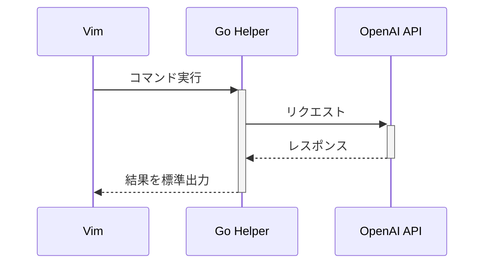

# Go実装設計書

## 1. アーキテクチャ概要

### 1.1 構成
```
hello-vim-plugin-2/
├── plugin/
│   └── roo.vim          # Vimプラグインのエントリーポイント
├── autoload/
│   └── roo/
│       ├── api.vim      # Go実行ファイルとの連携
│       ├── file.vim     # ファイル操作
│       └── ui.vim       # UI表示
└── cmd/
    └── roo-helper/      # Go実装
        ├── main.go      # エントリーポイント
        ├── api/         # API通信
        ├── models/      # データモデル
        └── vim/         # Vim連携
```

### 1.2 通信フロー


## 2. Go実装の詳細

### 2.1 メインプログラム
```go
// cmd/roo-helper/main.go
package main

import (
    "encoding/json"
    "flag"
    "fmt"
    "os"

    "github.com/username/hello-vim-plugin-2/cmd/roo-helper/api"
)

func main() {
    // コマンドライン引数の解析
    command := flag.String("command", "", "Command to execute")
    input := flag.String("input", "", "Input data")
    flag.Parse()

    // コマンドの実行
    result, err := executeCommand(*command, *input)
    if err != nil {
        fmt.Fprintf(os.Stderr, "Error: %v\n", err)
        os.Exit(1)
    }

    // 結果を標準出力に出力
    fmt.Println(result)
}

func executeCommand(command, input string) (string, error) {
    switch command {
    case "explain":
        return api.ExplainCode(input)
    default:
        return "", fmt.Errorf("unknown command: %s", command)
    }
}
```

### 2.2 API通信
```go
// cmd/roo-helper/api/openai.go
package api

import (
    "bytes"
    "encoding/json"
    "fmt"
    "net/http"
    "os"
)

type OpenAIRequest struct {
    Model    string    `json:"model"`
    Messages []Message `json:"messages"`
}

type Message struct {
    Role    string `json:"role"`
    Content string `json:"content"`
}

func ExplainCode(code string) (string, error) {
    apiKey := os.Getenv("ROO_API_KEY")
    if apiKey == "" {
        return "", fmt.Errorf("ROO_API_KEY is not set")
    }

    // リクエストの構築
    req := OpenAIRequest{
        Model: "gpt-4",
        Messages: []Message{
            {
                Role:    "system",
                Content: "You are a helpful assistant that explains code.",
            },
            {
                Role:    "user",
                Content: fmt.Sprintf("Please explain this code:\n\n%s", code),
            },
        },
    }

    // APIリクエストの実行
    return sendRequest(req, apiKey)
}

func sendRequest(req OpenAIRequest, apiKey string) (string, error) {
    // HTTPクライアントの設定
    client := &http.Client{}

    // JSONエンコード
    body, err := json.Marshal(req)
    if err != nil {
        return "", err
    }

    // リクエストの作成
    request, err := http.NewRequest(
        "POST",
        "https://api.openai.com/v1/chat/completions",
        bytes.NewBuffer(body),
    )
    if err != nil {
        return "", err
    }

    // ヘッダーの設定
    request.Header.Set("Content-Type", "application/json")
    request.Header.Set("Authorization", "Bearer "+apiKey)

    // リクエストの実行
    response, err := client.Do(request)
    if err != nil {
        return "", err
    }
    defer response.Body.Close()

    // レスポンスの解析
    var result struct {
        Choices []struct {
            Message struct {
                Content string `json:"content"`
            } `json:"message"`
        } `json:"choices"`
    }

    if err := json.NewDecoder(response.Body).Decode(&result); err != nil {
        return "", err
    }

    if len(result.Choices) == 0 {
        return "", fmt.Errorf("no response from API")
    }

    return result.Choices[0].Message.Content, nil
}
```

### 2.3 Vim連携
```vim
" autoload/roo/api.vim
function! roo#api#explain_code(code) abort
    " Go実行ファイルの呼び出し
    let cmd = [
        \ 'roo-helper',
        \ '-command', 'explain',
        \ '-input', a:code
        \ ]
    
    " 非同期実行
    return job_start(cmd, {
        \ 'out_cb': function('s:handle_output'),
        \ 'err_cb': function('s:handle_error'),
        \ 'exit_cb': function('s:handle_exit')
        \ })
endfunction

function! s:handle_output(channel, msg) abort
    " 出力の処理
    call roo#ui#show_output(a:msg)
endfunction

function! s:handle_error(channel, msg) abort
    " エラーの処理
    call roo#ui#show_error(a:msg)
endfunction

function! s:handle_exit(channel, status) abort
    " 終了処理
    if a:status != 0
        call roo#ui#show_error('Process exited with status: ' . a:status)
    endif
endfunction
```

## 3. ビルドと配布

### 3.1 ビルド手順
```bash
# Go実行ファイルのビルド
cd cmd/roo-helper
go build -o bin/roo-helper

# 実行ファイルの配置
cp bin/roo-helper ~/.vim/bin/
```

### 3.2 Makefileの作成
```makefile
.PHONY: build test clean

build:
    cd cmd/roo-helper && go build -o ../../bin/roo-helper

test:
    cd cmd/roo-helper && go test ./...

clean:
    rm -rf bin/
```

## 4. Goを選択する利点

1. パフォーマンス
   - 高速な実行速度
   - 効率的なメモリ使用
   - コンパイル済みバイナリ

2. 開発効率
   - 静的型付け
   - 優れたエラーハンドリング
   - 豊富な標準ライブラリ

3. 保守性
   - クリーンなコード構造
   - テストのしやすさ
   - 依存関係の管理

4. 配布の容易さ
   - シングルバイナリ
   - クロスコンパイル対応
   - 依存関係の解決不要

## 5. 実装手順

1. 基本構造の作成
   - Goプロジェクトの初期化
   - 必要なパッケージの追加
   - ビルドスクリプトの作成

2. コア機能の実装
   - コマンドライン引数の処理
   - API通信機能
   - JSONエンコード/デコード

3. Vim連携の実装
   - プラグインコマンドの作成
   - 非同期実行の設定
   - 結果表示の実装

4. テストとデバッグ
   - ユニットテストの作成
   - 統合テストの実装
   - エラーケースの確認

## 6. 注意点

1. クロスプラットフォーム対応
   - Windows/Mac/Linux対応
   - パス区切り文字の処理
   - 環境変数の扱い

2. エラーハンドリング
   - Goのエラー情報をVimに伝達
   - ユーザーフレンドリーなエラーメッセージ
   - ログ出力の実装

3. セキュリティ
   - API keyの安全な管理
   - 一時ファイルの扱い
   - 権限の確認

## 7. 将来の拡張性

1. 機能追加
   - 新しいAPIエンドポイント
   - カスタムコマンド
   - 高度な解析機能

2. パフォーマンス最適化
   - キャッシュ機能
   - 並行処理の活用
   - メモリ使用の最適化

3. インテグレーション
   - 他のツールとの連携
   - CI/CDパイプライン
   - モニタリング機能