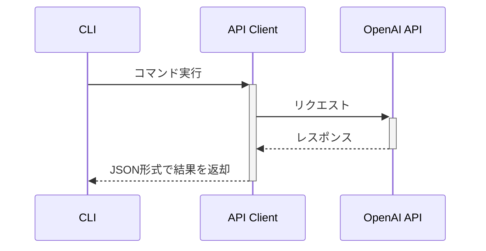

# Go実装設計書

## 1. アーキテクチャ概要

### 1.1 構成
```
hello-vim-plugin-2/
├── cmd/
│   └── roo/
│       ├── main.go      # CLIエントリーポイント
│       └── main_test.go # メインのテスト
├── internal/
│   ├── api/            # API通信
│   │   ├── client.go
│   │   └── client_test.go
│   └── models/         # データモデル
│       └── api.go
└── docs/              # ドキュメント
```

### 1.2 通信フロー


## 2. 実装の詳細

### 2.1 メインプログラム
```go
// cmd/roo/main.go
package main

import (
    "encoding/json"
    "flag"
    "fmt"
    "os"

    "github.com/username/hello-vim-plugin-2/internal/api"
    "github.com/username/hello-vim-plugin-2/internal/models"
)

func main() {
    // コマンドライン引数の解析
    command := flag.String("command", "", "Command to execute")
    input := flag.String("input", "", "Input data")
    flag.Parse()

    // APIクライアントの初期化
    client, err := api.NewClient()
    if err != nil {
        handleError(err)
    }

    // コマンドの実行
    result, err := executeCommand(client, *command, *input)
    if err != nil {
        handleError(err)
    }

    // 結果をJSON形式で出力
    outputResponse(models.Response{
        Success: true,
        Data:    result,
    })
}
```

### 2.2 APIクライアント
```go
// internal/api/client.go
package api

import (
    "bytes"
    "encoding/json"
    "fmt"
    "net/http"
    "os"
    "time"
)

type Client struct {
    httpClient *http.Client
    apiKey     string
    baseURL    string
}

func NewClient() (*Client, error) {
    apiKey := os.Getenv("OPENAI_API_KEY")
    if apiKey == "" {
        return nil, fmt.Errorf("OPENAI_API_KEY is not set")
    }

    return &Client{
        httpClient: &http.Client{
            Timeout: 30 * time.Second,
        },
        apiKey:  apiKey,
        baseURL: "https://api.openai.com/v1",
    }, nil
}

func (c *Client) CreateChatCompletion(messages []models.ChatMessage) (string, error) {
    // APIリクエストの実装
}
```

### 2.3 データモデル
```go
// internal/models/api.go
package models

type ChatMessage struct {
    Role    string `json:"role"`
    Content string `json:"content"`
}

type Response struct {
    Success bool        `json:"success"`
    Data    interface{} `json:"data,omitempty"`
    Error   string      `json:"error,omitempty"`
}
```

## 3. ビルドと配布

### 3.1 ビルド設定
```makefile
.PHONY: build test clean install

BINARY_NAME=roo
BUILD_DIR=bin

build:
    go build -o $(BUILD_DIR)/$(BINARY_NAME) ./cmd/roo

test:
    go test -v ./...

clean:
    rm -rf $(BUILD_DIR)

install:
    go install ./cmd/roo
```

## 4. Goを選択する利点

1. パフォーマンス
   - 高速な実行速度
   - 効率的なメモリ使用
   - シングルバイナリ配布

2. 開発効率
   - 静的型付け
   - 優れたエラーハンドリング
   - 豊富な標準ライブラリ

3. 保守性
   - クリーンなコード構造
   - テストのしやすさ
   - 依存関係の管理

## 5. 実装手順

1. 基本構造の作成
   - プロジェクト初期化
   - パッケージ構造の設定
   - 依存関係の管理

2. コア機能の実装
   - コマンドライン処理
   - API通信
   - JSON処理

3. テストとデバッグ
   - ユニットテスト
   - 統合テスト
   - エラーケース

## 6. 注意点

1. クロスプラットフォーム対応
   - Windows/Mac/Linux対応
   - パス区切り文字の処理
   - 環境変数の扱い

2. エラーハンドリング
   - 適切なエラーメッセージ
   - エラーのラッピング
   - ログ出力

3. セキュリティ
   - API keyの安全な管理
   - 一時ファイルの扱い
   - 入力のバリデーション

## 7. 将来の拡張性

1. 機能追加
   - 新しいサブコマンド
   - 追加のAPIエンドポイント
   - カスタム機能

2. パフォーマンス最適化
   - 並行処理
   - キャッシュ機能
   - メモリ最適化

3. インテグレーション
   - CI/CD対応
   - モニタリング
   - メトリクス収集