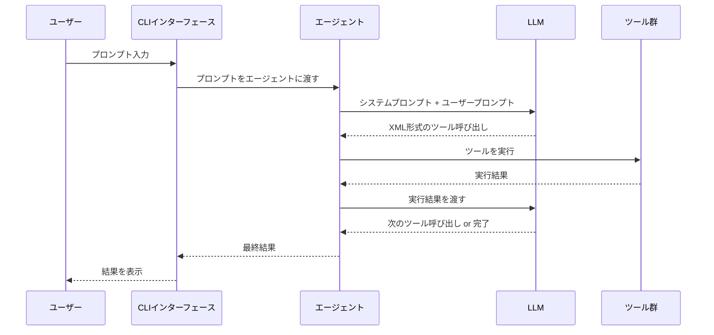
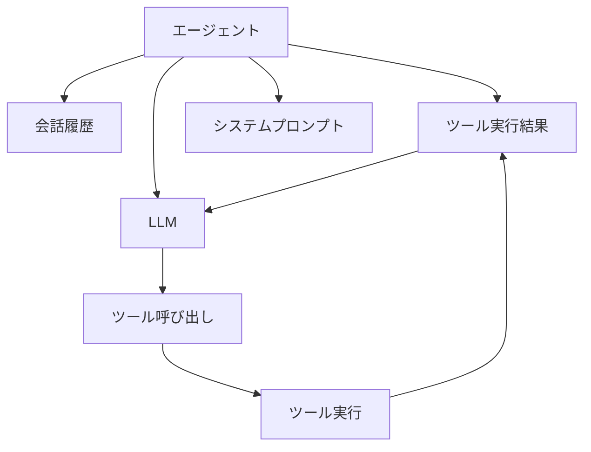
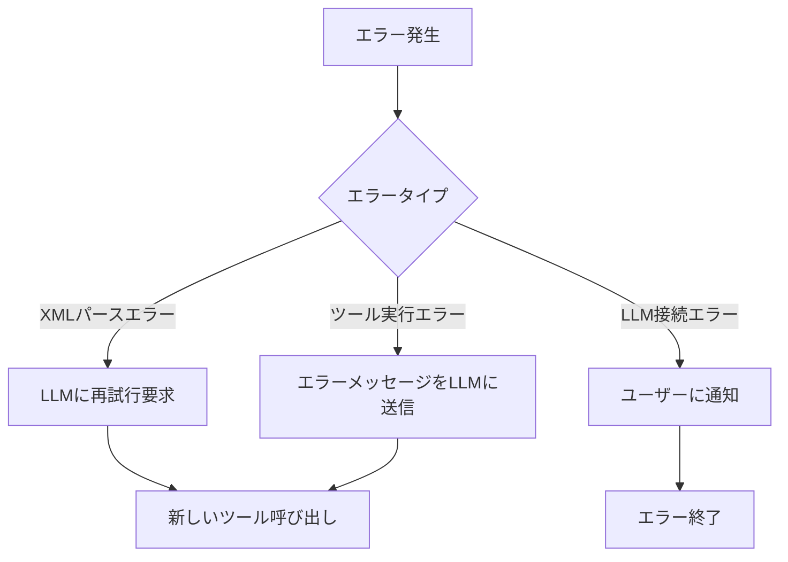

# AIエージェントの設計

## 概要
CLIで動作する、コードを読み取って解説を行うAIエージェントの設計書です。

## 基本構成

### 1. コアコンポーネント
- **エージェント**: LLMとツールを統合するメインコンポーネント
- **ツール**: エージェントが使用できる基本的な操作群
- **CLIインターフェース**: ユーザーとの対話を管理

### 2. 基本ツール
最小構成として以下のツールを実装します：

1. **ListFile**
   - ディレクトリ内のファイル一覧を取得
   - 再帰的な検索オプション付き

2. **ReadFile**
   - 指定されたファイルの内容を読み取り
   - ファイルパスの検証機能付き

3. **Complete**
   - タスク完了を示す
   - 結果のサマリーを返す

### 3. システムプロンプト
エージェントの基本的な振る舞いを定義するプロンプトを実装します：

```markdown
あなたはコードを読み取って解説を行うAIエージェントです。
以下のツールを使って、ユーザーの要求に応じてコードの解説を行ってください。

# ListFile
ディレクトリ内のファイル一覧を取得します。
<list_file>
<path>ディレクトリのパス</path>
<recursive>true または false</recursive>
</list_file>

# ReadFile
ファイルの内容を読み取ります。
<read_file>
<path>ファイルのパス</path>
</read_file>

# Complete
タスク完了を示します。
<complete>
<summary>タスクの結果サマリー</summary>
</complete>
```

## 技術スタック
- 言語: Go
- LLM: OpenAI API
- CLI: Cobra

## 今後の拡張性
1. コード解析機能の追加
   - AST解析
   - 依存関係の解析
2. コード生成機能
   - ファイル作成
   - コード編集
3. テスト機能
   - テストコード生成
   - テスト実行
4. ドキュメント生成
   - README生成
   - APIドキュメント生成 

## エージェントの対話フロー

### 1. 基本フロー


### 2. エージェントの内部状態管理



### 3. ツール実行の詳細フロー

1. **ユーザー入力の受信**
   - CLIがユーザーからのプロンプトを受け取る
   - プロンプトの前処理（文字列の正規化など）

2. **LLMへの送信**
   - システムプロンプト
   - 会話履歴
   - ユーザープロンプト
   - 前回までのツール実行結果

3. **LLMからの応答処理**
   - XMLのパース
   - ツール呼び出しの検証
   - パラメータの検証

4. **ツール実行**
   - ツールの選択
   - パラメータの渡し方
   - エラーハンドリング
   - 結果の収集

5. **結果の処理**
   - ツール実行結果の整形
   - LLMへのフィードバック
   - 会話履歴の更新

### 4. エラーハンドリング



### 5. 会話の永続化

- 会話履歴の保存形式
  ```json
  {
    "conversation_id": "string",
    "messages": [
      {
        "role": "user|assistant",
        "content": "string",
        "timestamp": "datetime",
        "tool_calls": [
          {
            "tool": "string",
            "parameters": {},
            "result": "string"
          }
        ]
      }
    ]
  }
  ``` 