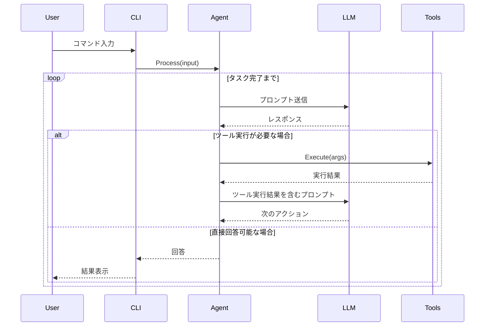

# makasero 設計ドキュメント

## 概要
makasero は、Goで実装されたAIエージェントのCLIツールです。Geminiをバックエンドとして使用し、ユーザーの要求を理解し、適切なアクションを実行します。

## アーキテクチャ

### 主要コンポーネント

1. **Agent**
   - エージェントのコアロジックを実装
   - Geminiとの通信を担当
   - ツールの実行を管理

2. **Tools**
   - エージェントが使用できるツール群
   - 各ツールは独立したインターフェースを実装
   - 例として `execCommand` を実装

3. **CLI**
   - コマンドラインインターフェース
   - ユーザーとの対話を管理

### ディレクトリ構造

```
.
├── agent/          # エージェントのコアロジック
│   ├── agent.go    # エージェントのメイン実装
│   └── gemini.go   # Geminiとの通信ロジック
├── tools/          # ツール実装
│   └── exec.go     # execCommand ツール
└── cmd/            # CLI実装
    └── makasero/   # メインコマンド
        └── main.go
```

## インターフェース設計

### Tool インターフェース

```go
type Tool interface {
    Name() string
    Description() string
    Execute(args map[string]interface{}) (string, error)
}
```

### Agent インターフェース

```go
type Agent interface {
    RegisterTool(tool Tool)
    Process(input string) (string, error)
}
```

## 処理フロー



## 実装の流れ

1. 基本的なディレクトリ構造の作成
2. Tool インターフェースの実装
3. execCommand ツールの実装
4. Agent の基本実装
5. Gemini との通信ロジックの実装
6. CLI の実装

## 今後の拡張性

- 新しいツールの追加が容易な設計
- 他のLLMプロバイダーのサポート追加が可能な設計
- プラグインシステムの導入可能性 